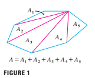

# a preview of calculus

Calculus is fundamentally(基础的，重要的) different form the mathematics that you have studied previously:calculus is less static and more dynamic. It is concerned(忧虑的) with change and motion(运动); it deals with quantities(工程量) that approach(接近) other quantities. For that reason it may be useful to have an overview of the subject before beginning its intensive(彻底的) study. Here we give a glimpse(一瞥) of some of the main ideas of calculus by showing how the concept of a limit arises when we attempt to solve a variety(种类) of perblems.

## the area problem

the origin of calculus go back at least 2500 years to the ancient Greeks, who found areas using the "method of exhaustion(穷举法)". They knew how to find the area A of any polygon(多边形) by dividing it into triangles as in Figure 1 and adding the areas of these triangles.

It is a much more difficult problem to find the area of a curved(曲线，弯曲) figure(图形). The Greek method of exhaustion was to inscribe(雕刻) polygons in the figure and circumscribe(划线，限定范围) polygons about the figure and then let the number of sides of the polygons increase. Figure 2 illustrates(插画，说明) this process for the special case of a circle with inscribed regular(整齐的，有规律的) polygons.

Let $A_{n}$ be the area of the inscribed polygon with $n$ sides. As $n$ increases. it appears that $A_{n}$ becomes closer and closer to the area of the circle. We say that the area of the circle is the *limit* of the areas of the incribed polygons,and we write $$A = \lim_{n \rightarrow \infin} A_{n}$$

The Greeks themselves did not use limits explicitly(明确的). Howerver ,by indirect(间接的) reasoning, Eudoxus(fifth century BC) used exhaustion to prove the familiar formula for the area of a circle: $A = \pi r^{2}$

We will use a similar idea in Chapter 5 to find areas of regions(区域) of the type shown in Figure 3.We will approximate(近似的) the desired(想得到) area A by areas of rearangles (as in Figure 4), let the width of the rectangles decrease(减少) , and the calculate A as the limit of these sums of areas of rectangles.

The area problem is the central(重要的) problem in the branch of calculus called *integral calculus*(积分). The techniques(技巧) that we will develop in Chapter 5 for finding areas will also enable us to compute the volume of a solid , the length of a curve, the force of water against a dam(水坝), the mass and center of gravity of a rod(杆，棒), and the work done in pumping(抽水) water out of a tank(罐).

## The Tangent(切线) Problem

Consider the problem of trying to find an equation(等式) of the tangent line *t* to a curve with equation $y = f(x)$ at a given point P. (We will give a precise(精确的) definition of a tangent line in Chapter 2. For now you can think of it as a line that touches the curve at P as in Figure 5.) Since we know that the point P lies on the tangent line, we can find the equation of *t* if we know its slope(倾斜的，斜率) m. The problem is that we need two points to compute the slope and we know only one point,P, on *t* .To get around the problem we first find an approximation to *m* by taking a nearby point Q on the curve and computing the slope $m_{PQ}$ of the secant(割线) line PQ. From Figure 6 we see that.

$$ m_{PQ} = \frac{f(x) - f(a)}{x-a} $$ Equation 1

Now imagine that Q moves along the curve toward P as in Figure 7. You can see that the secant line rotates and approaches the tangent line as its limiting position. This means that the slope $m_{PQ}$ of the secant line becomes closer and closer to the slope m of the tangent line . We write

$$m = \lim_{Q \rightarrow P} m_{PQ}$$

and we say that *m* is the limit of $m_{PQ}$ as Q approaches P along the curve. Since *x* approaches a as Q approaches P , we could also use Equation 1 to write

$$ m = \lim_{x \rightarrow a} \frac{f(x) - f(a)}{x-a} $$ Equation 2

Specific examples of this procedure(程序，步骤) will be given in Chapter 2.

The tangent problem has given rise to the branch of calculus called *differential calculus*(微分), which was not invented(发明) until more than 2000 years after integral calculus. The main ideas behinid differential calculus are due the French mathematician Pierre Fermat(1601-1665) and were developed by the English mathematicians John Wallis(1616-1703), Isaac Barrow(1630-1677),and Isaac Newton(1642-1727) and the German mathematician Gottfried Leibniz(1646-1716).

The two branches of calculus and their chief(主要的) problems,the area problem and the tangent problem, appear to be very differnt,but it turns out that there is a very close connection between them. The tangent problem and the area problem are inverse(相反) problems in a sense that will be described(描述，描写) in Chapter 5.
