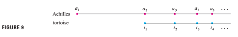

# a preview of calculus

Calculus is fundamentally(基础的，重要的) different form the mathematics that you have studied previously:calculus is less static and more dynamic. It is concerned(忧虑的) with change and motion(运动); it deals with quantities(工程量) that approach(接近) other quantities. For that reason it may be useful to have an overview of the subject before beginning its intensive(彻底的) study. Here we give a glimpse(一瞥) of some of the main ideas of calculus by showing how the concept of a limit arises when we attempt to solve a variety(种类) of perblems.

## the area problem

the origin of calculus go back at least 2500 years to the ancient Greeks, who found areas using the "method of exhaustion(穷举法)". They knew how to find the area A of any polygon(多边形) by dividing it into triangles as in Figure 1 and adding the areas of these triangles.

It is a much more difficult problem to find the area of a curved(曲线，弯曲) figure(图形). The Greek method of exhaustion was to inscribe(雕刻) polygons in the figure and circumscribe(划线，限定范围) polygons about the figure and then let the number of sides of the polygons increase. Figure 2 illustrates(插画，说明) this process for the special case of a circle with inscribed regular(整齐的，有规律的) polygons.

Let $A_{n}$ be the area of the inscribed polygon with $n$ sides. As $n$ increases. it appears that $A_{n}$ becomes closer and closer to the area of the circle. We say that the area of the circle is the *limit* of the areas of the incribed polygons,and we write $$A = \lim_{n \rightarrow \infty} A_{n}$$

The Greeks themselves did not use limits explicitly(明确的). Howerver ,by indirect(间接的) reasoning, Eudoxus(fifth century BC) used exhaustion to prove the familiar formula for the area of a circle: $A = \pi r^{2}$

We will use a similar idea in Chapter 5 to find areas of regions(区域) of the type shown in Figure 3.We will approximate(近似的) the desired(想得到) area A by areas of rearangles (as in Figure 4), let the width of the rectangles decrease(减少) , and the calculate A as the limit of these sums of areas of rectangles.

The area problem is the central(重要的) problem in the branch of calculus called *integral calculus*(积分). The techniques(技巧) that we will develop in Chapter 5 for finding areas will also enable us to compute the volume of a solid , the length of a curve, the force of water against a dam(水坝), the mass and center of gravity of a rod(杆，棒), and the work done in pumping(抽水) water out of a tank(罐).

## The Tangent(切线) Problem

Consider the problem of trying to find an equation(等式) of the tangent line *t* to a curve with equation $y = f(x)$ at a given point P. (We will give a precise(精确的) definition of a tangent line in Chapter 2. For now you can think of it as a line that touches the curve at P as in Figure 5.) Since we know that the point P lies on the tangent line, we can find the equation of *t* if we know its slope(倾斜的，斜率) m. The problem is that we need two points to compute the slope and we know only one point,P, on *t* .To get around the problem we first find an approximation to *m* by taking a nearby point Q on the curve and computing the slope $m_{PQ}$ of the secant(割线) line PQ. From Figure 6 we see that.

$$ m_{PQ} = \frac{f(x) - f(a)}{x-a} $$ **Equation 1**

Now imagine that Q moves along the curve toward P as in Figure 7. You can see that the secant line rotates and approaches the tangent line as its limiting position. This means that the slope $m_{PQ}$ of the secant line becomes closer and closer to the slope m of the tangent line . We write

$$m = \lim_{Q \rightarrow P} m_{PQ}$$

and we say that *m* is the limit of $m_{PQ}$ as Q approaches P along the curve. Since *x* approaches a as Q approaches P , we could also use Equation 1 to write

$$ m = \lim_{x \rightarrow a} \frac{f(x) - f(a)}{x-a} $$ **Equation 2**

Specific examples of this procedure(程序，步骤) will be given in Chapter 2.

The tangent problem has given rise to the branch of calculus called *differential calculus*(微分), which was not invented(发明) until more than 2000 years after integral calculus. The main ideas behinid differential calculus are due the French mathematician Pierre Fermat(1601-1665) and were developed by the English mathematicians John Wallis(1616-1703), Isaac Barrow(1630-1677),and Isaac Newton(1642-1727) and the German mathematician Gottfried Leibniz(1646-1716).

The two branches of calculus and their chief(主要的) problems,the area problem and the tangent problem, appear to be very differnt,but it turns out that there is a very close connection between them. The tangent problem and the area problem are inverse(相反) problems in a sense that will be described(描述，描写) in Chapter 5.

## Velocity(速率)

When we look at the speedometer(速度计) of a car and read that the car is traveling(移动的) at 48 km/h , whtat does that information indicate(标示) to us? We know that if the velocity remains constant(连续的，不变的), then after an hour we will have traveled 48 km. But if the velocity of the car varies(变化), what does it mean to say that the velocity at a given instant is 48 km/h?

In order to analyze this question, let's examine the motion of a car that travels along a straight road and assume(假定) that we can measure(测量，估算) the distance traveled by the car (in meters) at 1-second intervals as in the following chart:

As a first step toward finding the velocity after 4 seconds have elapsed(逝去), we find the average velocity during the time interval $ 4 \leq t \leq 8 $ :

$$ average \quad velocity = \frac{change \quad in \quad position}{time \quad elapsed} = \frac{43 - 10}{8 - 4} = 8.25 m/s $$

Similarly, the average velocity in the time interval $4 \leq t \leq 6$ is

$$ average \quad velocity =  \frac{25 - 10}{6 - 4} = 7.5 m/s $$

We have the feeling that the velocity at the instant $t = 4$ can't be much different from the average velocity during a short time interval starting at $t = 4$ .So let's imagine that the distance traveled has been measured at 0.2-second time intervals as in the following chart:

Then we can compute, for instance, the average velocity over the time interval [4,5]:

$$ average \quad velocity = \frac{16.80 - 10.00}{5 - 4} = 6.8 m/s $$

The results of such calculations are shown in the following chart:

The average velocities over successively smaller intervals appear to be getting closer to a number near 5, and so we expect that the velocity at exactly *t = 4* is about 5 m/s .In
Chapter 2 we will define the instantaneous velocity of a moving object as the limiting value of the average velocities over smaller and smaller time intervals.

In Figure 8 we show a graphical representation of the motion of the car by plotting the distance traveled as a function of time. If we write $d = f(t)$ ,then $f(t)$ is the number of meters traveled after t seconds. The average velocity in the time interval $[ 4, t]$ is

$$ average \quad velocity = \frac{change \quad in \quad position}{time \quad elapsed} = \frac{f(t) - f(4)}{t - 4} $$

which is the same as the slope of the secant line PQ in Figure 8. The velocity v when $ t = 4$, is the limiting value of this averae velocity as t approaches 4; that is,

$$ v = \lim_{t \rightarrow 4} \frac{f(t) - f(4)}{t - 4}$$

and we recognize from Equation 2 that this is the same as the slope of the tangent line to the curve at P.

Thus ,when we solve the tangent problem in differential calculus, we are also solving problems concerning velocities. The same techniques also enable us to solve problems involving rates of change in all of the natural and social sciences.

## The Limit of a Sequence(序列，顺序)

In the fifth century bc the Greek philosopher(哲学家) Zeno of Elea posed(主张，形成) four problems, now known as *Zeno's paradoxed(悖论)*, that were intended(打算，准备) to challenge(挑战) some of the ideas concerning(关于) space and time that were held in his day. Zeno's second paradox concerns(涉及，关系) a race between the Greek hero Achilles(阿基里斯) and a tortoise(迟缓的人，乌龟) that has been given a head start. Zeno argued(争论), as follows , that Achilles could never pass the tortoise:Suppose that Achilles starts at position $a_{1}$ and the tortoise starts at position $t_{1}$. (See Figure 9.) When Achilles reaches the point $a_{2}=t_{1}$ ,the tortoise is farther ahead at position $t_{2}$ .When Achilles reaches $a_{3} = t_{2}$ ,the tortoise is at $t_{3}$ .This process continues indefinitely(无限期) and so it appears that the tortoise will always be ahead! But this defies(挑战，对抗) common sense.

One way of explaining this paradox is with the idea of a *sequence*. The successive(连续的) positions of Achilles ($a_{1},a_{2},a_{3},...$) or the successive positions of the tortoise ($t_{1},t_{2},t_{3},...$) form what is known as a sequence.

In general, a sequence $a_{n}$ is a set of numbers written in a definite order. For instance, the sequence

$$ {1,\frac{1}{2},\frac{1}{3},\frac{1}{4},\frac{1}{5},...} $$

can be described by giving the following formula for the *nth* term:

$$ a_{n} = \frac{1}{n}$$

We can visualize this sequence by plotting(绘图) its terms on a number line as In Figure 10(a) or by drawing its graph as in Figure 10(b). Observe from eigher picture that the terms of the sequence $a_{n} = \frac{1}{n}$ are becoming closer and closer to 0 as *n* increases. In fact, we can find terms as small as we please by making *n* large enough. We say that the limit of the sequence is 0, and we indicate(指出) this by writing

$$ \lim_{n \rightarrow \infty} \frac{1}{n} = 0$$

In general, the notation

$$ \lim_{n \rightarrow \infty} a_{n} = L$$

is used if the terms $a_{n}$ approach the number $L$ as *n* becomes large. This means that the numbers $a_{n}$ can be make as close as we like to the number $L$ by taking *n* sufficiently(足够的) large.

The concept of the limit of a sequence occurs(重现) whenever we use the decimal representation of a real number. For instance, if

$$ a_{1} = 3.1 $$
$$ a_{2} = 3.14 $$
$$ a_{3} = 3.141 $$
$$ a_{4} = 3.1415 $$
$$ a_{5} = 3.14159 $$
$$ a_{6} = 3.141592 $$
$$ a_{7} = 3.1415926 $$
$$.$$
$$.$$
$$.$$

then

$$ \lim_{n \rightarrow \infty} a_{n} = \pi $$

The terms in this sequence are rational(合理的) approximations to $\pi$.

Let's return to Zeno's paradox. The successive positions of Achilles and the tortoise form sequences $a_{n}$ and $t_{n}$ , where $a_{n} \lt t_{n}$ for all *n*.
It can be shown that both sequences have the same limit:

$$\lim_{n \rightarrow \infty} a_{n} = p = \lim_{ n \rightarrow \infty} t_{n}$$

It is precisely(精确的) at this point *p* that Achilles overtakes(赶上) the tortoise.
