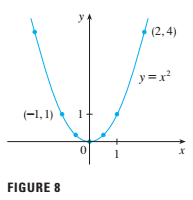

# functions and models

the fundamental(基本的) objects that we deal with in calculus are functions.This chapter prepares(准备) the way for calculus by discussing(讨论) the basic ideas concerning(关于) functions, their graphs,and ways of transforming and combining(组合) them. we stress(强调) that a function can be represented(表现) in different ways: by an equation, in a table, by a graph, or in words. we look at the main types of functions that occur(发生，存在) in calculus and describe the process of using these functions as mathematical models of real-world phenomena(现象). we also discuss the use of graphing calculators and graphing software for computers.

## four ways to represent a function

functions arise whenever one quantity depends on another, consider the following four situations.

- A. The area A of a circle depends on the radius r of the circle. the rule that connects r and A is given by the equation $ A = \pi r^2 $. with each positive number r there is associated(关联) one value of A, and we say that A is a function of r.

- B. the human population(人口) of the world P depends on the time t, the table gives estimates(估计) of th world population $p(t)$ at time t, for certain years. For instance,$$P(1950) \approx 2560000000$$ but for each value of the time t there is a corresponding(对应的) value of P, and we say that P is a function of t.

- C. the cost C of mailing(邮寄) a first-class letter depends on its weight w. although there is no simple formula that connects w and C,the post office has a rule for determining(确定) C when w is known.

- D. the vertical(垂直的) acceleration(加速) a of the ground as measured(测量) by a seismograph(地震仪) during an earthquake is a function of the elapsed(流逝) time t. Figure 1 shows a graph generated(发生形成) by seismic(地震的) activity during the Northridge earthquake that shook(震动) Los Angeles in 1994. for a given value of t, the graph provides a corresponding value of a.
  

each of these examples describes a rule whereby(凭什么), given a number (r,t,w,or t), another number(A,P,C,or a )is assigned(指定的，分派的). In each case we say that the second number is a function of the first number.

> a function f is a rule that assigns to each element x in a set D exactly one element, called $f(x)$, in a set E.

we usually consider functions for which the sets D and E are sets of real numbers. the set D is called the domain of the function. the number $f(x)$ is the value of f at x and is read 'f of x' the range of f is the set of all possible values of $f(x)$ as x varies throughout(始终在) the domain. a symbol that represents an arbitrary(随意的，主观的) number in the domain of a function f is called an independent variable. a symbol that represents a number in the range of f is called a dependent variable. In example A , for instance, r is the independent variable and A is the dependent variable.

it's helpful to think of a function as a machine (see Figure 2). if x is in the domain set the function f,then when x enters the machine, it's accepted as an input and the machine produces an output $f(x)$ according the rule of the function. thus we can think of the domain as the set of all possible inputs and the range as the set of all possible outputs.

the preprogrammed(预程序) functions in a calculator are good examples of a function as a machine. for example, the square root key on your calculator computes such a function. You press the key labeled $\sqrt{\space}$ (or $\sqrt{x}$) and enter the input x. if $x<0$ , then x is not in the domain of this function;that is ,x is not an acceptable input ,and the calculator will indicate(标明，指示) an error. if $x \geq 0$,then a approximation to $\sqrt{x}$ will appear in the display.thus the $\sqrt{x}$ key on your calculator is not quite the same as the exact(精确的) mathematical function f defined by $f(x) = \sqrt{x}$.

another way to picture a function is by an arrow diagram(图表，图解) as in Figure 3. each arrow connects an element of D to an element of E. the arrow indicates(指示，指出) that $f(x)$ is associated(关联) with x, $f(a)$ is associated with a, and so on.

the most common method for visualizing a function is its graph. if $f$ is a function with domain D, then its graph is the set of ordered pairs

$$\{(x,f(x))|x\in D \}$$

(Notice that these are input-output pairs.) In other words, the graph of f consists(组成，构成) of all points (x,y) in the coordinate(同等，并列，坐标) plane such that $y = f(x)$ and x is in the domain of f.

the graph of a function f gives us a usefull picture of the behavior or "life history" of a function . since the y-coordinate of any point (x,y) on the graph is $y = f(x)$ ,we can read the value of $f(x)$ from the graph as being the height of the graph above the point x (see Figure 4). the graph of $f$ also allows us to picture the domain of f on the x-axis and its range on the y-axis as in Figure 5.

*example 1* the graph of a function $f$ is shown in Figure 6.
(a) Find the values of $f(1)$ and $f(5)$.
(b) what are the domain and range of $f$?

*solution*
(a) we see from Figure 6 that the point (1,3) lies on the graph of $f$, so the value of $f$ at 1 is $f(1)=3$. (In other words, the point on the graph that lies above x $x = 1$ is 3 units above the x-axis.)
when $x = 5$ ,the graph llies about 0.7 unit below the x-axis, so ew estimate that $f(5) \approx -0.7$.
(b) we see that $f(x)$ is defined when $0 \geq x \geq 7$, so the domain of $f$ is the closed interval $[0,7]$. Notice that $f$ takes on all values from -2 to 4, so the range of $f$ is 

$$\{ y| -1 \geq y \geq 4\} = [-2,4]$$

*example 2* sketch the graph and find the domain and range of each function.
(a) $f(x) = 2x -1$
(b) $g(x) = x^2$

*solution*
(a) the equation of the graph is $y = 2x -1$, and we recognize this as being the equation of a line with slope 2 and y-intercept -1.(recall the slope-intercept form of the equation of a line: $y = mx + b$. See Appendix B.) thsi enables us to sketch a portion of the graph of $f$ in Figure 7. The expression $2x -1$ is defined for all real numbers, so the domain of $f$ is the set of all real numbers,which we denote by $R$. the graph shows that the range is also $R$.
(b) since $g(2)=2^2 = 4$ and $g(-1) = (-1)^2 = 1$, we could plot the points (2,4) and (-1,1), together with a few other points on the graph, and join them ot produce the graph(Figure 8). the equation of the graph is $y = x^2$ ,which represents a parabola(see Appendix C). the domain of $g$ is $R$. the range of $g$ consists of all values of $g(x)$, that is , all numbers of the form $x^2$. But $x^2 \geq 0$ for all numbers $x$ and any positive number $y$ is a square. so the range of $g$ is $\{y|y \geq 0\} = [0,\infin)$ this can also be seen from Figure 8.

*example 3* if $f(x) = 2x^2 - 5x +1$ and $h \neq 0$ ,evaluate $\frac{f(a+h)-f(a)}{h}$.

*solution* we first evaluate $f(a+h)$ by replacing $x$ by $a+h$ in the expression for $f(x)$:

$$
\begin{aligned}
f(a+h) &= 2(a+h)^2 - 5(a+h)+1 \\
&= 2(a^2 + 2ah +h^2) - 5(a+h) +1 \\
&= 2a^2 + 4ah + 2h^2 - 5a - 5h +1
\end{aligned}$$

then we substitute into the given expression and simplify:

$$
\begin{aligned}
\frac{f(a+h)-f(a)}{h} &= \frac{(2a^2 + 4ah +2h^2 - 5a -5h +1) -(2a^2 -5a + 1)}{h} \\
&= \frac{2a^2 + 4ah + 2h^2 - 5a -5h +1 -2a^2 + 5a -1}{h} \\
&= \frac{4ah +2h^2 - 5h}{h} = 4a +2h - 5
\end{aligned}$$